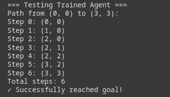
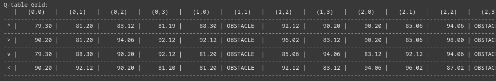

# Reinforcement Learning Projects Collection (will be uploaded soon, almost finished)

A collection of reinforcement learning implementations showcasing fundamental to advanced algorithms.

📋 Repository Structure
```
RL-Projects/
├── 1-Q-Learning-GridWorld/
│   ├── ql_earning.ipynb
│   ├── media/
│       ├── Q_Table_Visualization.png
│       ├── agent_test.png
│       └── policy.png
├── 2-DeepQ-Network-CartPole/
│   ├── dqn_cartpole.ipynb
│   ├── cartpole_model/
│   │   └── DQN.keras
│   ├── media/
│   │   ├── cart_pole.gif
│   │   ├── DQN_policy_viz.png
│   │   └── dqn_net.png
│   └── README.md
├── 3-PPO-Pong/
│   ├── ppo_pong.ipynb
│   ├── ppo_models/
│   │   ├── pong_ppo_early.zip
│   │   └── pong_ppo_best.zip
│   ├── media/
│   │   ├── ponggif.gif
│   │   ├── ppo_model_arch.png
│   │   ├── action_prob_ppo.png
│   │   └── preprocessing.png
│   └── README.md
├── requirements.txt
└── README.md (main repository README)
```

# 📁 Projects Overview
## 1. 🤖 Q-Learning: Grid World Navigation

This implementation demonstrates classic Q-Learning in a 4x4 grid environment with obstacles. The agent starts at (0,0) and learns to navigate to the goal at (3,3) while avoiding obstacles.

Key Features:
- Tabular Q-learning implementation
- Dynamic exploration-exploitation balance (ε-greedy)
- Policy visualization
- Custom grid environment with obstacles

Results:
 - Learned Policy: 
 - Test Results: 
 - Q-Table Visualization: 

---------

## 2. 🧠 Double Deep Q-Network: CartPole Balancing

A PyTorch implementation of Deep Q-Network (DQN) with experience replay and target network stabilization to solve the CartPole-v1 environment from Gymnasium.

### 🎯 Features
 - Double DQN - Reduces overestimation bias
 - Experience Replay - Learns from past experiences
 - Target Network - Stabilizes training
 - Epsilon-Greedy - Balanced exploration vs exploitation

### 📈 Training Results

https://cartpole_model/training_results.png

The agent typically solves CartPole-v1 (195+ average score) in 200-300 episodes using this configuration.


### 🎮 Demo
https://demo/demo.gif

### 🚀 Quick Start
- Installation
```
pip install gymnasium torch matplotlib
```

- Training
```
python train.py
```

- Testing
```
python test.py
```

### 🏗️ Architecture
 - Network: 3-layer MLP (24 → 24 neurons)
 - Algorithm: Double DQN with experience replay
 - Optimizer: Adam (lr=0.001)
 - State Space: 4 dimensions
 - Action Space: 2 actions (left/right)

### 📁 Project Structure
```
├── agent.py          # DQN agent implementation
├── ddqn.py           # Neural network architecture  
├── train.py          # Training script
├── test.py           # Testing/evaluation script
└── cartpole_model/   # Saved models & training plots
```

--------


## 3. 🎮 Proximal Policy Optimization: Atari Pong
Screenshot: media/action_prob_ppo.png

Key Features:
- Policy gradient optimization with clipping
- Convolutional neural network for pixel input
- Frame stacking and preprocessing
- Advantage estimation using GAE

Model Architecture:
- Input: 84x84x4 stacked frames
- CNN Backbone: 3 convolutional layers
- Heads: Actor (policy) + Critic (value)
- Training: 0M timesteps with stable learning

## 🛠️ Installation
```
git clone https://github.com/yourusername/RL-Projects.git
cd RL-Projects
```

## Install dependencies
```
pip install -r requirements.txt
```

requirements.txt:
```
gymnasium==0.29.1
tensorflow==2.15.0
stable-baselines3==2.0.0
numpy==1.24.3
ale-py==0.9.0
opencv-python==4.8.1
wandb==0.16.1
```


## 📊 Algorithm Comparison
Algorithm	Type	State Space	Action Space	Best For
Q-Learning	Value-based	Discrete	Discrete	Small, tabular environments
DQN	Value-based	Continuous	Discrete	High-dimensional observations
PPO	Policy-based	Continuous	Discrete/Continuous	Complex, stochastic environments
